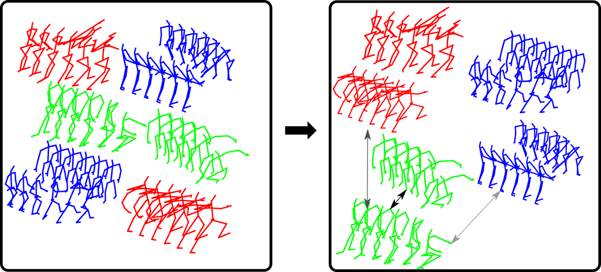
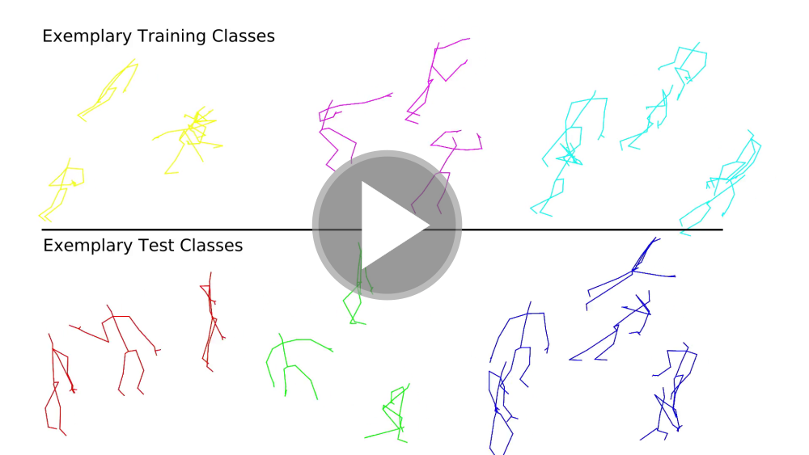

# Skeleton-DML 



This repository contains the source code to reproduce the results from the Skeleton-DML paper.
A pre-print can be found on [arxiv](https://arxiv.org/abs/2012.13823).

# Video Abstract


[](https://www.youtube.com/watch?v=jH5eMDZfMyY)

<!--[Video](https://userpages.uni-koblenz.de/~raphael/videos/sl-dml.mp4)-->

<!--## Citation-->

<!--```-->
<!--@article{memmesheimer2020signal,-->
  <!--title={Signal Level Deep Metric Learning for Multimodal One-Shot Action Recognition},-->
  <!--author={Memmesheimer, Raphael and Theisen, Nick and Paulus, Dietrich},-->
  <!--journal={arXiv preprint arXiv:2004.11085},-->
  <!--year={2020}-->
<!--}-->
<!--```-->

## Requirements

<!--* `pip install -r requirements.txt`-->
*  Skeleton-DML is based on the [pytorch-metric-learning](https://github.com/KevinMusgrave/pytorch-metric-learning) library

## Precalculated Representations

We provide precalculated representations for all conducted experiment splits of the Skeleton-DML representation:

* [NTU RGB+D 120 One-Shot](https://agas.uni-koblenz.de/skeleton-dml/skeleton-dml-ntu_120_one_shot.zip)

## Quick Start


```
git clone https://github.com/raphaelmemmesheimer/skeleton-dml
cd skeleton-dml
pip install -r requirements.txt
export DATASET_FOLDER="$(pwd)/data"
mkdir -p data/ntu/
wget https://agas.uni-koblenz.de/skeleton-dml/skeleton-dml-ntu_120_one_shot.zip
unzip skeleton-dml-ntu_120_one_shot.zip -d $DATASET_FOLDER/ntu/ntu_reindex
python train.py dataset=ntu_reindex
```
when returning you have to set the dataset folder again:

```
export DATASET_FOLDER="$(pwd)/data"
python train.py dataset=ntu_reindex
```

Note, the following commands require an environment variable `$DATASET_FOLDER` to be existing.

Training for the NTU 120 one-shot action recognition experiments can be executed like:

`python train.py dataset=ntu_reindex`

During development, we suggest using the classes `A002, A008, A014, A020, A026, A032, A038, A044, A050, A056, A062, A068, A074, A080, A086, A092, A098, A104, A110,  A116` as validation classes.
